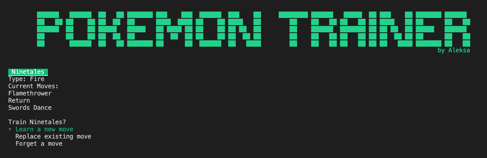

# Pokemon Trainer App #

## Overview ##

You've volunteered to help train pokemon at a Pokemon Daycare!
You will be able to:
* Choose a Pokemon from the daycare roster
* Teach it a new move
* Ask it to forget a move
* Replace an existing move in its movepool

## Built With ##
Ruby, ActiveRecord, Rake, TTYPrompt, Colorize 

## Features ##
* Easy to navigate menus so that you can easily switch between Pokemon or keep bonding with the same one.
* ASCII art, animations, music and general cuteness :)

## Try it yourself ##
1. Download zip and `cd` into the project.
2. `bundle install` all gems and dependencies
3. `rake db:migrate` 
4. `rake db:seed`
5. `ruby bin/run.rb` to run the file
6. Happy training!

## Resources used ##
* [Colorize](https://github.com/fazibear/colorize) - to add color to the CLI
* [TTYPrompt](https://github.com/piotrmurach/tty-prompt) - CLI prompts
* [Ascii Art Converter](https://manytools.org/hacker-tools/convert-images-to-ascii-art/) - converts images to Ascii Art
* [Pokemon Ascii Version](https://bellblitzking.itch.io/pokemonasciiversion) - used fanfare sound effects
* [Text to Ascii Art](http://patorjk.com/software/taag/#p=display&f=Graffiti&t=Type%20Something%20) - used for Logo
